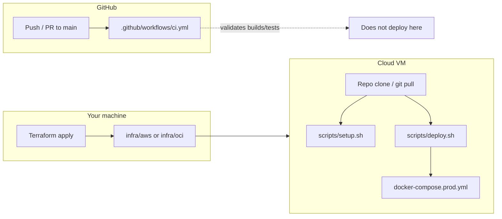

# How deployment works today

This describes the **actually wired paths** in this repo: **GitHub Actions CI** (validation on every push/PR to `main`) and **manual infrastructure + VM deploy** (Terraform + Docker Compose on a single VM). There is **no automatic CD** from GitHub into AWS/OCI unless you add it yourself.

---

## Mental model

| Concern | Mechanism |
| -------- | --------- |
| **Quality gate before merge** | GitHub Actions builds frontend, runs Go/Java tests, smoke-tests Compose |
| **Provision VM + network** | Terraform under `infra/aws` or `infra/oci` |
| **Install Docker & clone repo** | Cloud-init on first boot (`cloud-init.yaml`) |
| **Secrets & env** | `.env.prod` on the VM (`scripts/generate-env.sh`, template `.env.prod.example`) |
| **Run app stack** | `docker compose --env-file .env.prod -f docker-compose.prod.yml` |

---

## 1. CI/CD — GitHub Actions

### What runs

Workflow file: **`.github/workflows/ci.yml`**

| Trigger | Purpose |
| ------- | ------- |
| `push` to **`main`** | Full CI after merge |
| `pull_request` targeting **`main`** | Gate before merge |

Concurrency uses `cancel-in-progress` so newer pushes supersede stale runs on the same ref.

### Jobs and responsibilities

| Job | Working dir / context | What it does |
| --- | --------------------- | ------------- |
| **frontend** | `frontend/` | `npm ci`, `npm run build` |
| **meeting-go** | `services/meeting-go/` | `go test ./...` |
| **auth-java** | `services/auth-java/` | `mvn -B test` |
| **e2e-smoke** | repo root | Waits for **`docker compose`** (default **`docker-compose.yml`**) — frontend on `:3000`; installs Chrome; **`pytest tests/e2e`** |

`e2e-smoke` **`needs`** the three compile/test jobs so obvious breakage fails fast.

### Pros and cons (GitHub Actions as implemented)

| Pros | Cons |
| ---- | ---- |
| Reproducible checks on clean Ubuntu runners | **Not deployment**: VM is untouched |
| Parallel jobs keep wall-clock reasonable | E2E stack is slower/heavier than unit-only CI |
| Catches regressions in frontend build, JVM tests, Go tests, and basic routing | Compose smoke uses **dev-oriented** `docker-compose.yml`, not **`docker-compose.prod.yml`** |
| Uses official actions (`checkout`, `setup-node`, `setup-go`, `setup-java`, `setup-python`) | E2E may need retries/timing tweaks if flaky under load |

### Improving CI/CD later

- Add **`workflow_dispatch`** or **`release`** triggers that SSH/rsync or push images to a registry and restart the VM — currently **out of scope** of the checked-in workflow.
- Optionally mirror prod with a job that validates **`docker-compose.prod.yml`** build (requires secrets simulation or dummy `DOMAIN`).
- Cache Docker layers in GHA for faster e2e.

---

## 2. Terraform — provision the VM

Two interchangeable modules (pick one via **`Makefile`** variable **`CLOUD`**):

| Directory | Cloud | Typical use |
| --------- | ----- | ------------- |
| **`infra/aws/`** | AWS EC2 + VPC + SG + EIP | Free tier / paid small instance |
| **`infra/oci/`** | Oracle Cloud ARM instance | Always-free tier with more RAM |

### Files (same shape in both folders)

| File | Role |
| ---- | ---- |
| **`main.tf`** | Providers, VPC/network, security rules, compute instance, SSH key wiring, user-data → cloud-init |
| **`variables.tf`** | Inputs (region, instance shape, SSH key path, repo URL, domain hints, etc.) |
| **`outputs.tf`** | **`public_ip`** and other values consumed by **`Makefile`** / docs |
| **`terraform.tfvars.example`** | Copy to **`terraform.tfvars`** (usually gitignored); local overrides |
| **`cloud-init.yaml`** | First-boot: Docker install, optional swap, **clone repo** into `/home/ubuntu/letsgo`, etc. |
| **`README.md`** | Provider-specific steps and caveats |
| **`.gitignore`** | Typically ignores `.terraform/`, `*.tfstate*`, `terraform.tfvars` |

Root **`Makefile`** abstracts Terraform:

- **`CLOUD=aws`** → `infra/aws`
- **`CLOUD=oci`** (default) → `infra/oci`

Targets: **`tf-init`**, **`tf-plan`**, **`tf-apply`**, **`tf-destroy`**, **`wait`** (SSH/cloud-init), **`remote-setup`** / **`remote-deploy`** (SSH into VM).

### Pros and cons (Terraform single-VM)

| Pros | Cons |
| ---- | ---- |
| Repeatable infra; **`terraform destroy`** tears down cleanly | Single VM = single point of failure |
| VPC + SG isolate this project from rest of account | No built-in auto-scaling or rolling deploy |
| Elastic IP (AWS) / stable public endpoint patterns | State file must be handled carefully (remote backend not enforced in-repo) |
| Same app deploy scripts regardless of AWS vs OCI | Cold start RAM on smallest AWS SKU is tight (see **`infra/aws/README.md`**) |

---

## 3. On the VM — scripts and Compose

After Terraform + cloud-init, the app is deployed with shell wrappers around **production Compose**.

### Shell scripts (`scripts/`)

| Script | Purpose |
| ------ | ------- |
| **`lib.sh`** | Shared paths: **`REPO_ROOT`**, **`ENV_FILE=.env.prod`**, **`COMPOSE_FILE=docker-compose.prod.yml`**, **`compose()`** helper |
| **`generate-env.sh`** | Creates **`.env.prod`** from **`.env.prod.example`** with generated secrets (invoked by **`setup.sh`** if missing) |
| **`setup.sh`** | First-time: generate env if missing → **`deploy.sh`** |
| **`deploy.sh`** | `docker compose pull` (best-effort) → **`compose up -d --build`** |
| **`down.sh`** | Stop stack without destroying volumes |
| **`logs.sh`** | Tail Compose logs |
| **`wait-for-vm.sh`** | Local helper: wait until SSH + cloud-init ready (**`Makefile`** **`wait`**) |

### Compose files

| File | Role |
| ---- | ---- |
| **`docker-compose.yml`** | Local dev / **CI e2e**: exposed ports, simpler TLS story |
| **`docker-compose.prod.yml`** | **Production**: internal Postgres/auth/meeting; **Caddy** on 80/443 with Let’s Encrypt; **coturn** UDP range; **`migrate`** job before apps |

Details inside **`docker-compose.prod.yml`** include: **`postgres`**, **`migrate`** ( **`migrations/go/`** ), **`auth-java`**, **`meeting-go`**, **`frontend`** (nginx serving built SPA), **`caddy`**, **`coturn`**.

### Env template

| File | Role |
| ---- | ---- |
| **`.env.prod.example`** | Document required variables (`DOMAIN`, `POSTGRES_PASSWORD`, `LETSGO_JWT_SECRET`, TURN settings, …) |

---

## 4. Typical flows

### First-time production deploy

1. Configure Terraform (`terraform.tfvars` from example).
2. **`make tf-init tf-apply`** (or **`CLOUD=aws make …`**).
3. **`make wait`** until VM is ready.
4. SSH to VM; ensure repo at **`~/letsgo`** (cloud-init clone or your rsync).
5. **`bash scripts/setup.sh`** → creates **`.env.prod`**, runs **`deploy.sh`**.
6. Point DNS **`A`** record at **`public_ip`**; wait for Caddy + ACME.

### Subsequent releases

1. **`git pull`** (or rsync) on the VM.
2. **`bash scripts/deploy.sh`** — rebuild and recreate containers.

From laptop: **`make remote-deploy`** runs **`git pull`** + **`deploy.sh`** over SSH (requires **`Makefile`**’s **`VM_IP`** from **`terraform output`**).

---

## 5. Summary trade-off table

| Piece | Strength | Weakness |
| ----- | -------- | -------- |
| **GHA CI** | Fast feedback; blocks broken merges | Does not publish or restart prod |
| **Terraform** | Infra as code; reproducible VM | Operational maturity (state locking, drift) is on you |
| **Docker Compose on one VM** | Simple ops model; matches README quickstarts | Vertical scaling only; deploy interrupts unless extended |
| **Manual / scripted deploy** | Full control; no cloud secrets in GitHub | Human or custom automation step required |
| **Prod vs CI Compose drift** | CI stays fast with dev compose | Prod-only issues (TLS, Caddy, TURN) not exercised in default CI |

For **HTTPS / Let’s Encrypt / Caddy**, see **`docs/https-tls.md`**.

For product-level technical trade-offs (mesh WebRTC, Postgres, JWT, etc.), see **`docs/engineering-tradeoffs.md`**.
