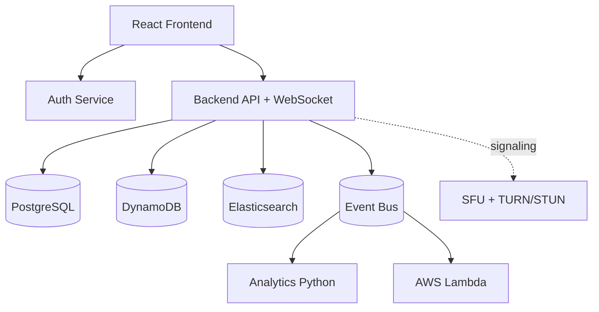

# Video Meeting App Design Package

This section applies the platform architecture to a video meeting product with:

- secure login and authorization
- one-to-one and group calls
- in-meeting chat and message history
- meeting analytics and quality monitoring

## Files in This Section

- `entity-diagram.md`
- `postgres-schema.md`
- `dynamodb-schema.md`
- `system-design.md`
- `data-flow-diagram.md`
- `sequence-diagram.md`

## Design Intent

- Keep transactional truth in PostgreSQL.
- Use DynamoDB for high-volume, low-latency chat and signaling state.
- Use WebRTC for media plane and websocket signaling through backend services.
- Keep observability, reliability, and scaling consistent with the platform standards.

## High-Level Diagram

