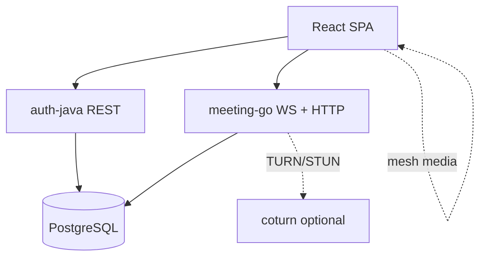

# Video Meeting App Design Package

This section applies the platform architecture to a video meeting product with:

- secure login and authorization
- one-to-one and group calls
- in-meeting chat and message history
- meeting analytics and quality monitoring

## Files in This Section

- `entity-diagram.md`
- `postgres-schema.md`
- `system-design.md`
- `data-flow-diagram.md`
- `sequence-diagram.md`

## Design intent

- Keep transactional truth in **PostgreSQL** (users, connections, messages, saved backgrounds—see **`migrations/go/`**).
- Use **WebRTC** for media (mesh in the prototype) and **WebSockets** via **meeting-go** for signaling, invites, and chat fan-out within a room.
- Optional future scaling (SFU, regional hubs, analytics pipeline) belongs in diagrams labeled **target**—see **`docs/engineering-tradeoffs.md`**.

## Prototype vs target (letsgo repo)

The **checked-in runnable stack** uses **mesh WebRTC**, **PostgreSQL** for persistence, **auth-java** for JWT + REST, and **meeting-go** for **room** + **notify** WebSockets plus HTTP APIs for DM/room history/recents. Invites use the **notify** channel (in-memory hub today).

When you read `system-design.md` and `data-flow-diagram.md`, treat SFU / DynamoDB / Elasticsearch / analytics workers as **forward-looking** unless the section explicitly describes the **current** Docker Compose slice. Session-level notes live under **`docs/changes/`**.

## High-Level Diagram

**Target-platform sketches** (SFU, DynamoDB fan-out, analytics bus) appear in older diagrams elsewhere—compare with **`docs/architecture/system-overview.md`**.
