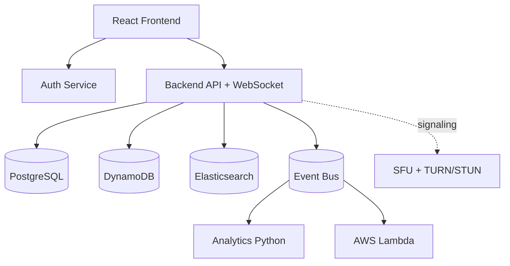

# Video Meeting App Design Package

This section applies the platform architecture to a video meeting product with:

- secure login and authorization
- one-to-one and group calls
- in-meeting chat and message history
- meeting analytics and quality monitoring

## Files in This Section

- `entity-diagram.md`
- `postgres-schema.md`
- `dynamodb-schema.md`
- `system-design.md`
- `data-flow-diagram.md`
- `sequence-diagram.md`

## Design intent

- Keep transactional truth in PostgreSQL.
- Use DynamoDB for high-volume, low-latency chat and signaling state.
- Use WebRTC for media plane and websocket signaling through backend services.
- Keep observability, reliability, and scaling consistent with the platform standards.

## Prototype vs target (letsgo repo)

The **checked-in runnable stack** uses **mesh WebRTC** (peer-to-peer with signaling via **meeting-go**), **PostgreSQL** for users, and **no SFU** in Docker by default. Invites use a **dedicated notify WebSocket** rather than a DynamoDB-backed signal queue. When you read `system-design.md` and `data-flow-diagram.md`, treat the SFU / DynamoDB / Elasticsearch paths as **forward-looking** unless explicitly labeled as the “prototype” slice. Session-level file lists live under **`docs/changes/`**.

## High-Level Diagram

**Current repo shortcut:** `FE --> AUTH` (auth-java) and `FE --> MTG[meeting-go WebSocket]` + `MTG --> PG`; mesh media between browsers.
