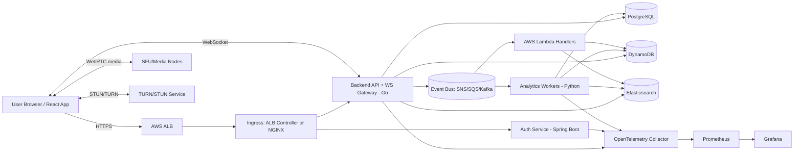

# Data Flow Diagram

## Data Movement Notes

- Chat writes can first land in DynamoDB for low-latency fanout, then be compacted or mirrored to PostgreSQL for audit/reporting.
- Meeting metadata and participant state changes are persisted in PostgreSQL.
- Search indexing consumes backend and analytics events for near-real-time discovery.
