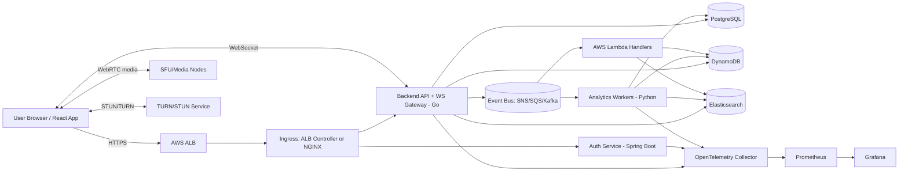
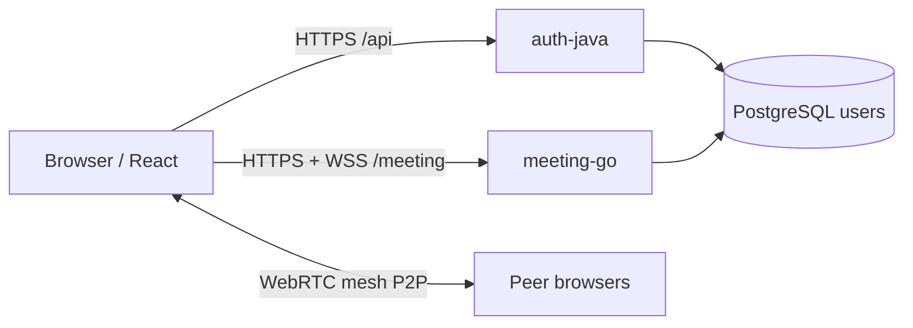

# Data Flow Diagram

## Target production data flow

The diagram below describes the **long-term** platform: shared Go API, optional DynamoDB for high-volume signaling/chat, SFU for media, and analytics/event indexing.

## Letsgo prototype (Docker / local dev)

The repository currently runs a **smaller** path: React behind nginx (or Vite dev server), **auth-java** for `/api`, **meeting-go** for `/meeting` (HTTP lookup + two WebSocket routes), and **PostgreSQL** for users only. WebRTC media flows **mesh** between browsers; meeting-go relays SDP/ICE only.

Notify WebSocket delivers **`incoming-call`** payloads to online callees; room WebSocket carries **`webrtc-*`** messages between participants in the same `roomId`. See `services/meeting-go/README.md` and `docs/changes/2026-05-04.md`.

## Data movement notes (target platform)

- Chat writes can first land in DynamoDB for low-latency fanout, then be compacted or mirrored to PostgreSQL for audit/reporting.
- Meeting metadata and participant state changes are persisted in PostgreSQL.
- Search indexing consumes backend and analytics events for near-real-time discovery.
