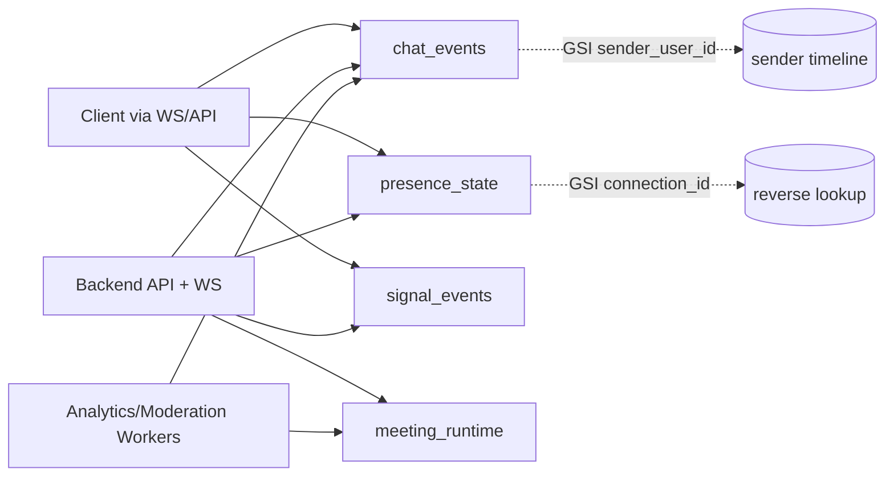

# DynamoDB Schema

Use DynamoDB for high-throughput, low-latency operational workloads: live chat stream, presence, and signaling/session state.

## Table Access Pattern Diagram

## Table 1: `chat_events`

- **PK**: `room_id`
- **SK**: `event_ts_msg_id` (example: `2026-04-22T10:11:33.100Z#<message_id>`)
- **Attributes**:
  - `message_id` (string)
  - `sender_user_id` (string)
  - `content` (string)
  - `message_type` (string)
  - `metadata` (map)
  - `ttl_epoch` (number, optional for ephemeral messages)

### GSIs

- `GSI1` for user lookup:
  - `GSI1PK = sender_user_id`
  - `GSI1SK = event_ts_msg_id`

## Table 2: `presence_state`

- **PK**: `meeting_id`
- **SK**: `user_id`
- **Attributes**:
  - `connection_id` (string)
  - `presence_status` (string: online, reconnecting, offline)
  - `last_seen_epoch` (number)
  - `device_type` (string)
  - `ttl_epoch` (number)

### GSIs

- `GSI1` for reverse lookup by socket connection:
  - `GSI1PK = connection_id`
  - `GSI1SK = meeting_id`

## Table 3: `signal_events`

- **PK**: `meeting_id`
- **SK**: `signal_ts_peer` (example: `2026-04-22T10:12:40.000Z#peer-a->peer-b`)
- **Attributes**:
  - `from_user_id` (string)
  - `to_user_id` (string)
  - `signal_type` (string: offer, answer, ice-candidate)
  - `payload` (map)
  - `ttl_epoch` (number, short TTL)

## Table 4: `meeting_runtime`

- **PK**: `meeting_id`
- **SK**: `state_key` (example: `session`, `sfu-node`, `feature-flags`)
- **Attributes**:
  - `state_value` (map)
  - `updated_at_epoch` (number)

## Capacity and TTL Guidance

- Start with on-demand capacity, then switch heavy tables to provisioned with auto scaling.
- Enable TTL on transient records (`presence_state`, `signal_events`).
- Keep partition key cardinality high to avoid hot partitions (room and meeting IDs naturally distribute well).
