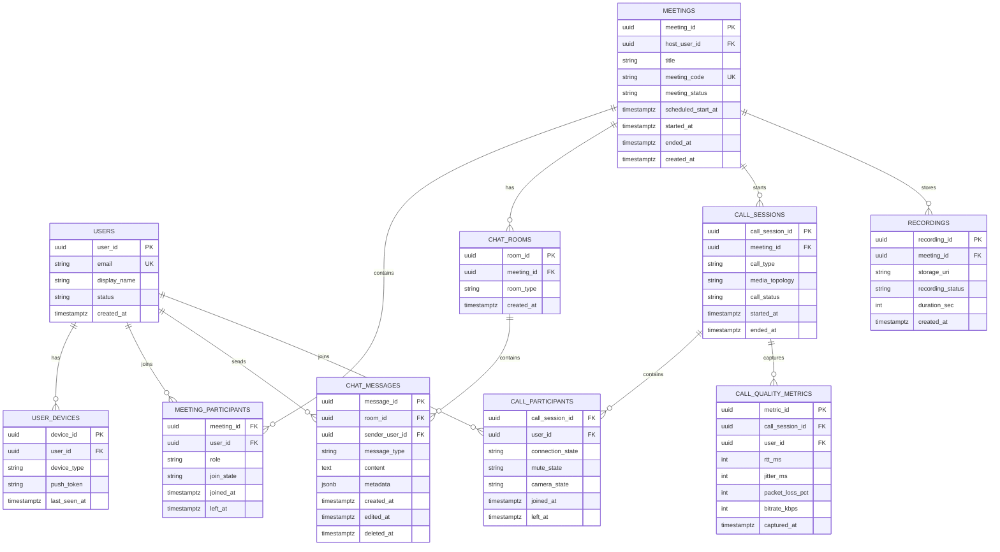

# Entity Diagram

The core source-of-truth entities are modeled in PostgreSQL. DynamoDB stores high-velocity operational data.

```mermaid
erDiagram
    USERS ||--o{ USER_DEVICES : has
    USERS ||--o{ MEETING_PARTICIPANTS : joins
    USERS ||--o{ CHAT_MESSAGES : sends
    USERS ||--o{ CALL_PARTICIPANTS : joins

    MEETINGS ||--o{ MEETING_PARTICIPANTS : contains
    MEETINGS ||--o{ CHAT_ROOMS : has
    MEETINGS ||--o{ CALL_SESSIONS : starts
    MEETINGS ||--o{ RECORDINGS : stores

    CHAT_ROOMS ||--o{ CHAT_MESSAGES : contains
    CALL_SESSIONS ||--o{ CALL_PARTICIPANTS : contains
    CALL_SESSIONS ||--o{ CALL_QUALITY_METRICS : captures

    USERS {
      uuid user_id PK
      string email UK
      string display_name
      string status
      timestamptz created_at
    }

    USER_DEVICES {
      uuid device_id PK
      uuid user_id FK
      string device_type
      string push_token
      timestamptz last_seen_at
    }

    MEETINGS {
      uuid meeting_id PK
      uuid host_user_id FK
      string title
      string meeting_code UK
      string meeting_status
      timestamptz scheduled_start_at
      timestamptz started_at
      timestamptz ended_at
      timestamptz created_at
    }

    MEETING_PARTICIPANTS {
      uuid meeting_id FK
      uuid user_id FK
      string role
      string join_state
      timestamptz joined_at
      timestamptz left_at
    }

    CHAT_ROOMS {
      uuid room_id PK
      uuid meeting_id FK
      string room_type
      timestamptz created_at
    }

    CHAT_MESSAGES {
      uuid message_id PK
      uuid room_id FK
      uuid sender_user_id FK
      string message_type
      text content
      jsonb metadata
      timestamptz created_at
      timestamptz edited_at
      timestamptz deleted_at
    }

    CALL_SESSIONS {
      uuid call_session_id PK
      uuid meeting_id FK
      string call_type
      string media_topology
      string call_status
      timestamptz started_at
      timestamptz ended_at
    }

    CALL_PARTICIPANTS {
      uuid call_session_id FK
      uuid user_id FK
      string connection_state
      string mute_state
      string camera_state
      timestamptz joined_at
      timestamptz left_at
    }

    CALL_QUALITY_METRICS {
      uuid metric_id PK
      uuid call_session_id FK
      uuid user_id FK
      int rtt_ms
      int jitter_ms
      int packet_loss_pct
      int bitrate_kbps
      timestamptz captured_at
    }

    RECORDINGS {
      uuid recording_id PK
      uuid meeting_id FK
      string storage_uri
      string recording_status
      int duration_sec
      timestamptz created_at
    }
```
