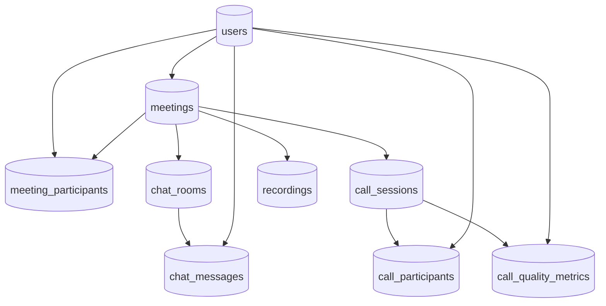

# PostgreSQL Schema

## Implemented schema (source of truth)

The **applied** database shape for this repo is defined by SQL migrations under **`migrations/go/`** (run automatically via Docker entrypoints before apps start). Treat the DDL snippets below as **design reference**—when they diverge from migrations, **migrations win**.

Current migration files include users, connections (contacts), DM messages, meeting room metadata/messages/recents, and optional user-uploaded virtual backgrounds (`000004_create_user_backgrounds`).

---

This document also sketches broader relational modeling for a larger product: identities, meetings, participants, call sessions, and message audit history.

## Schema Relationship Diagram



## Suggested Extensions

```sql
CREATE EXTENSION IF NOT EXISTS "pgcrypto";
CREATE EXTENSION IF NOT EXISTS "citext";
```

## Core Tables

```sql
CREATE TABLE users (
  user_id UUID PRIMARY KEY DEFAULT gen_random_uuid(),
  email CITEXT NOT NULL UNIQUE,
  display_name VARCHAR(120) NOT NULL,
  status VARCHAR(24) NOT NULL DEFAULT 'active',
  created_at TIMESTAMPTZ NOT NULL DEFAULT now()
);

CREATE TABLE meetings (
  meeting_id UUID PRIMARY KEY DEFAULT gen_random_uuid(),
  host_user_id UUID NOT NULL REFERENCES users(user_id),
  title VARCHAR(200) NOT NULL,
  meeting_code VARCHAR(20) NOT NULL UNIQUE,
  meeting_status VARCHAR(24) NOT NULL DEFAULT 'scheduled',
  scheduled_start_at TIMESTAMPTZ,
  started_at TIMESTAMPTZ,
  ended_at TIMESTAMPTZ,
  created_at TIMESTAMPTZ NOT NULL DEFAULT now()
);

CREATE TABLE meeting_participants (
  meeting_id UUID NOT NULL REFERENCES meetings(meeting_id) ON DELETE CASCADE,
  user_id UUID NOT NULL REFERENCES users(user_id),
  role VARCHAR(20) NOT NULL DEFAULT 'participant',
  join_state VARCHAR(20) NOT NULL DEFAULT 'invited',
  joined_at TIMESTAMPTZ,
  left_at TIMESTAMPTZ,
  PRIMARY KEY (meeting_id, user_id)
);

CREATE TABLE chat_rooms (
  room_id UUID PRIMARY KEY DEFAULT gen_random_uuid(),
  meeting_id UUID NOT NULL REFERENCES meetings(meeting_id) ON DELETE CASCADE,
  room_type VARCHAR(20) NOT NULL DEFAULT 'meeting',
  created_at TIMESTAMPTZ NOT NULL DEFAULT now()
);

CREATE TABLE chat_messages (
  message_id UUID PRIMARY KEY DEFAULT gen_random_uuid(),
  room_id UUID NOT NULL REFERENCES chat_rooms(room_id) ON DELETE CASCADE,
  sender_user_id UUID NOT NULL REFERENCES users(user_id),
  message_type VARCHAR(20) NOT NULL DEFAULT 'text',
  content TEXT NOT NULL,
  metadata JSONB NOT NULL DEFAULT '{}'::jsonb,
  created_at TIMESTAMPTZ NOT NULL DEFAULT now(),
  edited_at TIMESTAMPTZ,
  deleted_at TIMESTAMPTZ
);

CREATE TABLE call_sessions (
  call_session_id UUID PRIMARY KEY DEFAULT gen_random_uuid(),
  meeting_id UUID NOT NULL REFERENCES meetings(meeting_id) ON DELETE CASCADE,
  call_type VARCHAR(20) NOT NULL DEFAULT 'group',
  media_topology VARCHAR(20) NOT NULL DEFAULT 'sfu',
  call_status VARCHAR(20) NOT NULL DEFAULT 'started',
  started_at TIMESTAMPTZ NOT NULL DEFAULT now(),
  ended_at TIMESTAMPTZ
);

CREATE TABLE call_participants (
  call_session_id UUID NOT NULL REFERENCES call_sessions(call_session_id) ON DELETE CASCADE,
  user_id UUID NOT NULL REFERENCES users(user_id),
  connection_state VARCHAR(20) NOT NULL DEFAULT 'connecting',
  mute_state VARCHAR(20) NOT NULL DEFAULT 'unmuted',
  camera_state VARCHAR(20) NOT NULL DEFAULT 'on',
  joined_at TIMESTAMPTZ NOT NULL DEFAULT now(),
  left_at TIMESTAMPTZ,
  PRIMARY KEY (call_session_id, user_id)
);

CREATE TABLE call_quality_metrics (
  metric_id UUID PRIMARY KEY DEFAULT gen_random_uuid(),
  call_session_id UUID NOT NULL REFERENCES call_sessions(call_session_id) ON DELETE CASCADE,
  user_id UUID NOT NULL REFERENCES users(user_id),
  rtt_ms INT,
  jitter_ms INT,
  packet_loss_pct INT,
  bitrate_kbps INT,
  captured_at TIMESTAMPTZ NOT NULL DEFAULT now()
);

CREATE TABLE recordings (
  recording_id UUID PRIMARY KEY DEFAULT gen_random_uuid(),
  meeting_id UUID NOT NULL REFERENCES meetings(meeting_id) ON DELETE CASCADE,
  storage_uri TEXT NOT NULL,
  recording_status VARCHAR(20) NOT NULL DEFAULT 'processing',
  duration_sec INT,
  created_at TIMESTAMPTZ NOT NULL DEFAULT now()
);
```

## Index Strategy

```sql
CREATE INDEX idx_meetings_host_created_at ON meetings(host_user_id, created_at DESC);
CREATE INDEX idx_participants_user_joined ON meeting_participants(user_id, joined_at DESC);
CREATE INDEX idx_chat_messages_room_created ON chat_messages(room_id, created_at DESC);
CREATE INDEX idx_call_sessions_meeting_started ON call_sessions(meeting_id, started_at DESC);
CREATE INDEX idx_quality_call_time ON call_quality_metrics(call_session_id, captured_at DESC);
```

## Notes

- Keep chat canonical history in PostgreSQL only if strict auditing is needed. Otherwise, keep full message history in DynamoDB and replicate selected records to PostgreSQL.
- Use migrations (Flyway, Liquibase, or golang-migrate) from CI/CD pipelines.
