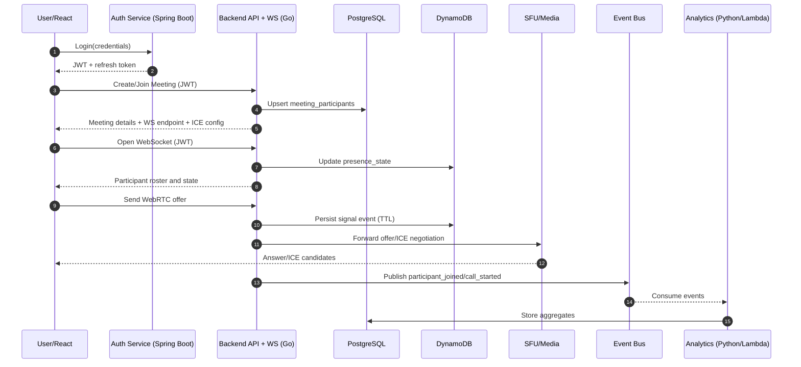
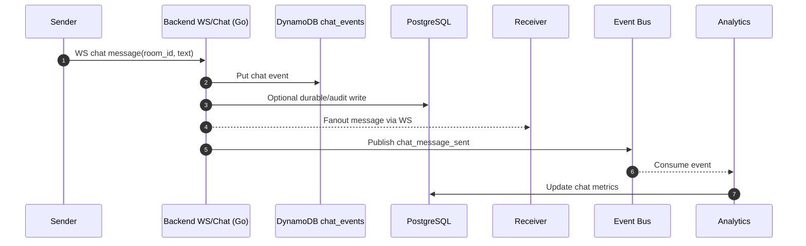
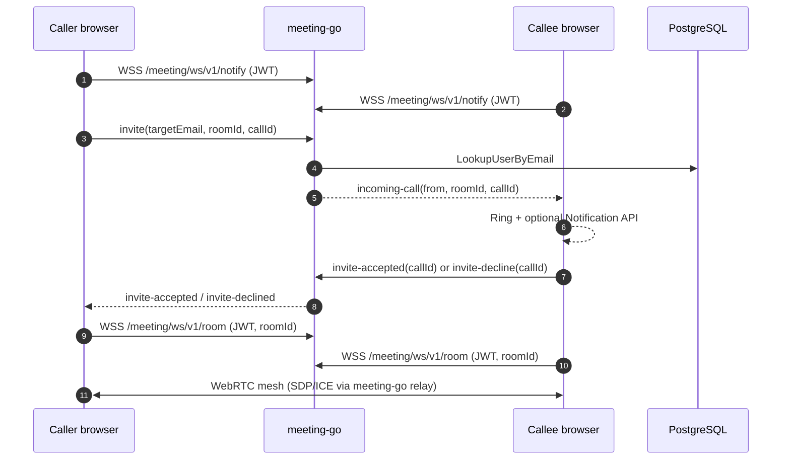

# Sequence Diagram

## Sequence 1: Join Meeting and Start Call

## Sequence 2: Send In-Meeting Chat Message

## Sequence 3: Prototype — mesh join + invite ring (letsgo)

This matches **`services/meeting-go`** + **`frontend`** behavior in Docker/local dev: no SFU, no DynamoDB. Callee must have the app open with an active **notify** WebSocket.

