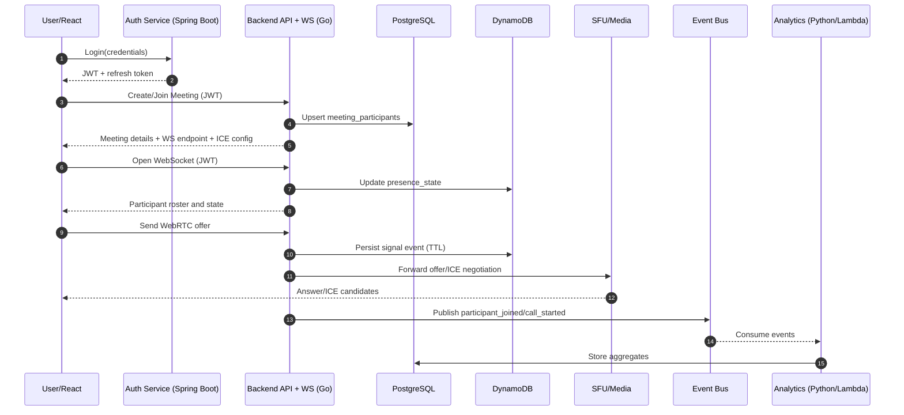
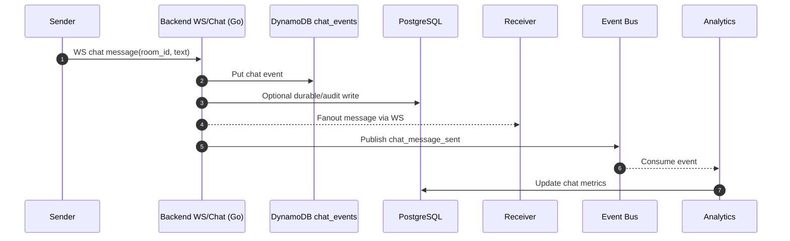

# Sequence Diagram

## Sequence 1: Join Meeting and Start Call

```mermaid
sequenceDiagram
    autonumber
    participant User as User/React
    participant Auth as Auth Service (Spring Boot)
    participant API as Backend API + WS (Go)
    participant PG as PostgreSQL
    participant DDB as DynamoDB
    participant SFU as SFU/Media
    participant EVT as Event Bus
    participant AN as Analytics (Python/Lambda)

    User->>Auth: Login(credentials)
    Auth-->>User: JWT + refresh token
    User->>API: Create/Join Meeting (JWT)
    API->>PG: Upsert meeting_participants
    API-->>User: Meeting details + WS endpoint + ICE config

    User->>API: Open WebSocket (JWT)
    API->>DDB: Update presence_state
    API-->>User: Participant roster and state

    User->>API: Send WebRTC offer
    API->>DDB: Persist signal event (TTL)
    API->>SFU: Forward offer/ICE negotiation
    SFU-->>User: Answer/ICE candidates

    API->>EVT: Publish participant_joined/call_started
    EVT-->>AN: Consume events
    AN->>PG: Store aggregates
```

## Sequence 2: Send In-Meeting Chat Message

```mermaid
sequenceDiagram
    autonumber
    participant UserA as Sender
    participant API as Backend WS/Chat (Go)
    participant DDB as DynamoDB chat_events
    participant PG as PostgreSQL
    participant UserB as Receiver
    participant EVT as Event Bus
    participant AN as Analytics

    UserA->>API: WS chat message(room_id, text)
    API->>DDB: Put chat event
    API->>PG: Optional durable/audit write
    API-->>UserB: Fanout message via WS
    API->>EVT: Publish chat_message_sent
    EVT-->>AN: Consume event
    AN->>PG: Update chat metrics
```
