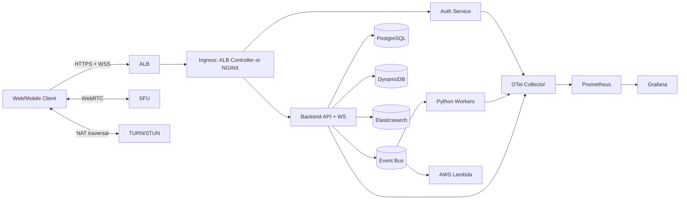

# System Design: Video Meeting App

## Topology Diagram

## Microservice Responsibilities

## `frontend` (React)

- Renders meeting UI, chat, participant controls.
- Maintains websocket connection for live chat/signaling events.
- Uses WebRTC for media (audio/video) in browser.

## `auth-service` (Spring Boot)

- Login, token issuance, refresh, revocation.
- Role and permission checks for meeting host/moderator actions.

## `backend-api` (Go)

- Meeting lifecycle APIs: create, join, leave, schedule, invite.
- Chat API for persistence and history pagination.
- Websocket signaling gateway for call negotiation and chat fanout.
- Publishes domain events for analytics and notifications.

## `analytics-service` (Python workers + AWS Lambda)

- Consumes events (join, leave, chat sent, call quality sample).
- Computes engagement and QoS aggregates.
- Produces dashboards/search enrichments.

## Network and Edge Layer

- **External entry**:
  - AWS Application Load Balancer (ALB) for HTTPS APIs and websocket upgrades.
- **Ingress in cluster**:
  - NGINX Ingress Controller (optional if ALB ingress is not directly used for routing complexity).
  - If using ALB ingress controller only, NGINX is optional.
- **Media transport**:
  - Use SFU component for group calls.
  - For UDP-heavy media paths, consider NLB in front of media/SFU nodes.
- **NAT traversal**:
  - STUN/TURN (coturn) required for reliable WebRTC across restrictive networks.

## Data Stores and Purpose

- **PostgreSQL**: meetings, participants, call sessions, durable records.
- **DynamoDB**: presence, signaling events, high-throughput chat/event stream.
- **Elasticsearch**: meeting and chat search, optional transcript search.

## Messaging/Event Backbone

- Event bus (SQS/SNS, Kafka, or MSK) for asynchronous processing.
- Event contracts versioned using schema registry conventions.

## Observability and Reliability

- OpenTelemetry SDK in all services.
- Prometheus metrics exposed from Go, Java, Python workers.
- Grafana dashboards for:
  - API latency/error rates
  - active meetings and participants
  - chat throughput
  - call quality (RTT, jitter, packet loss)
- Alerting on:
  - auth failures spike
  - websocket disconnect surge
  - media quality degradation

## Security Model

- JWT tokens validated at backend and websocket gateway.
- mTLS for internal service communication where required.
- Secrets in AWS Secrets Manager and injected to pods.
- WAF on ALB for common web attack mitigation.
